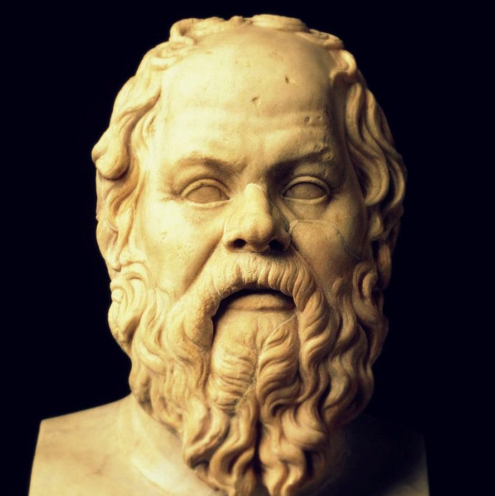

class: middle center

# *What is Philosophy?*

*an introduction* 

George Matthews, Pennsylvania College of Technology

*2020*

.note[press "h" for help on keyboard controls]

---
## *What is philosophy?*

--

.left-column[

  

]

--

.right-list[

"The unexamined life is not worth living."

]

--

.right-list[

- One of the founders of Western philosophy, Socrates spent his life encouraging others to critically examine their fundamental values and assumptions.

]

--

.right-list[

- He was executed for "corrupting the youth."

]

--

.right-column[

.question[

Why did people find Socrates' questions so threatening that they killed an old man who would likely soon pass away anyway?

]

]

---
layout: true
### *philo-sophia*

---

--

The word "philosophy" comes from the Greek words for "love of wisdom."

--
 
- Philosophy seeks understanding of the nature of reality and the significance of our lives by applying critical reasoning to our deepest and most general beliefs.

--

- It draws out basic assumptions, by asking questions with all of the wonder of children.

--

- And it subjects them to careful analysis with all of the precision of a lawyer.

---

.caution[

.red[Science] also seeks to understand reality, but it differs from philosophy in its method of evaluating its claims.

]

--

- If you are wrong in science your predictions fail, or you blow up the lab.

--

- If you are wrong in philosophy, your principles and most general beliefs conflict with each other and your mind is at odds with itself.

--

- Failure to clarify one's life philosophically may seem unimportant, yet for Socrates such an un-examined life misses what is most valuable about being human.

---

.caution[

.red[Religion] addresses the significance of our lives, but it differs from philosophy in how it proceeds.

]

--

- Religion emerges from the spontaneous ways we make meaning in our lives. It often embraces mythical and magical thinking which places us at the center of life's drama.

--

- Philosophy seeks clarification and justification and asks how we might find meaning in a world even where it might not be all about us.

---
layout: false

## *Philosophical questions*

.leftbar[
   

]

--

.middletext[

  

.left-blurb[

"How should I live my life? In pursuit of power and money or in pursuit of wisdom?" 

]

]

--

.right-list[

- This is not a question about how we do in fact live but of how we *should* live.

]

--

.right-list[

- Such *normative* questions challenge us to give an account of ourselves, our values and our assumptions.

]

--

.right-list[

- Socrates' question is a question in the sub-field of philosophy called .red[value theory] or .red[axiology].

]

---
layout: false

## *Philosophical questions*

.leftbar[
   

]

--

.middletext[

  

.left-blurb[

"What can I know with any degree of certainty, when my senses so often mislead me?"

]

]

--

.right-list[

- Descartes asked this question at the beginning of the Scientific Revolution when old certainties were revealed to be based on false assumptions.

]

--

.right-list[

- Answering it requires clarifying the nature of knowledge and its varieties.

]

--

.right-list[

- This is a question in the sub-field of philosophy called .red[epistemology] or .red[theory of knowledge].

]

---
layout: false

## *Philosophical questions*

.leftbar[
   

]

--

.middletext[

  

.left-blurb[

"Why is there something and not just nothing at all?"

]

]

--

.right-list[

- Philosophical questions are often much more general than questions we normally encounter.

]

--

.right-list[

- Science seeks answers to particular questions about the regularities in the world of our experience and shrinks away from such general questions as being unanswerable.

]

--

.right-list[

- This is a question in the sub-field of philosophy called .red[metaphysics] or .red[ontology] which seeks an account of the basic nature of reality.

]

---
layout: true

## *The philosopher's toolkit*

---

---
layout: true

### *Socrates and  Thrasymachus debate justice*

  
---

--

- As an example of how philosophical analysis proceeds, consider the following dialogue between Socrates and Thrasymachus, a contemporary of Socrates who held that philosophical questioning was irrelevant.

--

- For Thrasymachus, might makes right in the sense that the powerful get to define what key ideas like "justice" really mean.

--

- Socrates, on the other hand highlights how true wisdom alone can guide us and so we must let logic lead the way.

---
.leftbar[

   

]

.middletext[

  

.left-blurb[

What is Justice?

]
]

.rightbar[

   

]

---

.leftbar[

   

]

.middletext[

  

.right-blurb[

Whatever the powerful say it is?

]

]

.rightbar[

   

]
---

.leftbar[

   

]

.middletext[

  

.left-blurb[

So you say that might makes right? But even the powerful makes mistakes, right?

]

]

.rightbar[

   

]
---
.leftbar[

   

]

.middletext[

  

.right-blurb[

Yes and what are you getting at?

]

]

.rightbar[

   

]

---
.leftbar[

   

]

.middletext[

  

.left-blurb[

Well even the powerful rely on something more powerful than them, what is truly in their best interests.

]

]

.rightbar[

   

]

---

layout: false
### *Find out more*

[Socrates on self-confidence](https://youtu.be/_gVyEOefhIQ) and questioning others about their values. A great video outlining the motivation for doing philosophy in the first place.

---
class: center credits

#### Credits

*Built with:*

[Rstudio](https://rstudio.com/products/rstudio/) 

[xarignan](https://github.com/yihui/xaringan) html presentation framework 

<!-- *Photos by:* -->

[download this presentation](./pdf/01-introduction.pdf) or [print it](./pdf/01-introduction-print.pdf)

[editorial suggestions and comments](https://github.com/gwmatthews/philosophy-slideshows/issues): requires a (free) GitHub account.

