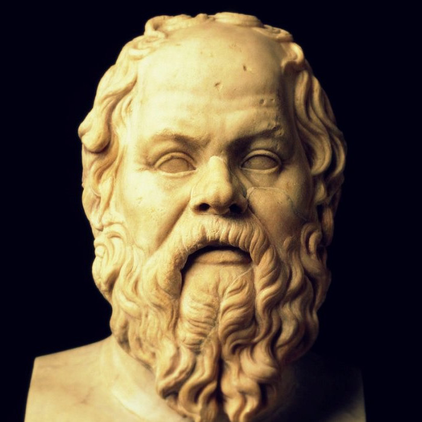
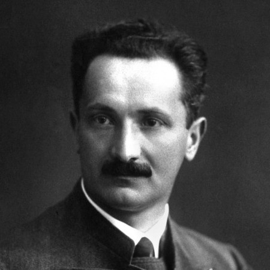
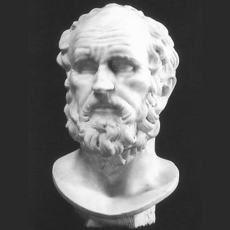
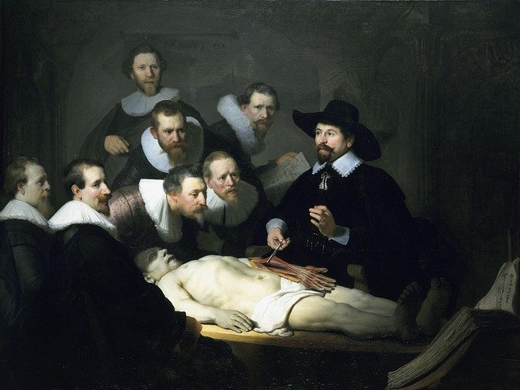

class: middle center

# *What is Philosophy?*

.red[*the examined life*]

George Matthews, Pennsylvania College of Technology

*2020*

---
## *What is philosophy?*

--

.left-column[

  

]

--

.middletext[

.left-blurb[

"The unexamined life is not worth living."

]
]

--

.right-list[

- One of the founders of Western philosophy, Socrates spent his life encouraging others to critically examine their fundamental values and assumptions.

]

--

.right-list[

- He was executed for "corrupting the youth."

]

--

.right-list[

.question[

Why did people find Socrates' questions so threatening that they killed an old man who would likely soon pass away anyway?

]

]

---
layout: true
### *philo-sophia*

---

--

The word "philosophy" comes from the Greek words for "love" (*philos*) and "wisdom" (*sophia*) and might be literally translated as "the love or pursuit of wisdom."

--
 
- Philosophy seeks understanding of the nature of reality and the significance of our lives by applying critical reasoning to our deepest and most general beliefs.

--

- It draws out basic assumptions, by asking questions with all of the wonder of a child.

--

- And it subjects them to careful analysis with all of the precision of a lawyer.

--

.question[

What is the difference between wisdom and knowledge? Can one know things without being wise or the other way around?

]

---

.caution[

.red[Science] also seeks to understand reality, but it differs from philosophy in its method of evaluating its claims.

]

 

--

- If you are wrong in science your predictions fail, or you accidentally blow up the lab.

--

- If you are wrong in philosophy, your principles and most general beliefs conflict with each other and so your mind is at odds with itself.

--

- Failure to clarify one's life philosophically may seem unimportant, yet for Socrates not doing so is to lead an "unexamined life" and miss out on what is most valuable and unique about being human.

---

.caution[

.red[Religion] addresses the significance of our lives, but it differs from philosophy in how it proceeds.

]

 

--

- Religion emerges from the spontaneous ways we make meaning in our lives. It often embraces mythical and magical thinking, which place us at the center of life's drama.

--

- Philosophy seeks clarification and justification and asks how we might find meaning, even in a world where we are not at the center of things.

--

- Philosophy is fundamentally "humanistic" since it trusts our ability to figure things out, while religion often appeals to faith, emphasizing the limits of our ability to comprehend things.

---
layout: false
## *Philosophical questions*

--

.leftbar[
   

]

--

.middletext[

  

.left-blurb[

"How should I live my life? In pursuit of power and money or in pursuit of wisdom?" 

]

]

--

.right-list[

- This is not a question about how we do in fact live but of how we *should* live.

]

--

.right-list[

- Such *normative* questions challenge us to give an account of ourselves, our values and our assumptions.

]

--

.right-list[

- Socrates' question is a question in the sub-field of philosophy called .red[value theory] or .red[axiology].

]

---
layout: false

.pull-left[

 

### .center[.red[*More value theory questions...*]]
]

.pull-right[

]

 

--

- Is morality in the eye of the beholder or are some things *really* right or wrong?

--

- Can the ends ever justify the means, or should some things just never be done?

--

- What would a just society look like and how might we get there from here?

--

- What is the value of art and should artists care about who their work might offend?

---
layout: false

## *Philosophical questions*

.leftbar[
   

]

--

.middletext[

  

.left-blurb[

"What can I know with any degree of certainty, when my senses so often mislead me?"

]

]

--

.right-list[

- Descartes asked this question at the beginning of the Scientific Revolution when old "certainties" were revealed to be based on false assumptions.

]

--

.right-list[

- Answering it requires clarifying the nature and limitations of knowledge.

]

--

.right-list[

- This is a question in the sub-field of philosophy called .red[epistemology] or .red[theory of knowledge].

]

---
layout: false

.pull-left[

 

### .center[.red[*More epistemological questions...*]]
]

.pull-right[

]

 

--

- How can we distinguish between appearances and reality?

--

- What counts as evidence, proof, or disproof and how does logical reasoning work?

--

- What is science and how do we distinguish it from pretenders to science?

--

- What is truth and is it singular or plural?

---
layout: false
## *Philosophical questions*

.leftbar[
   

]

--

.middletext[

  

.left-blurb[

"Why is there something and not just nothing at all?"

]

]

--

.right-list[

- Philosophical questions are often much more general than questions we normally encounter.

]

--

.right-list[

- Science seeks answers to particular questions about the regularities in the world of our experience and shrinks away from such general questions as this.

]

--

.right-list[

- This is a question in the sub-field of philosophy called .red[metaphysics] or .red[ontology] which seeks an account of the basic nature of reality.

]

---
layout: false

.pull-left[

 

### .center[.red[*More metaphysical questions...*]]
]

.pull-right[

]

 

--

- What sorts of things exist -- only matter, or minds/souls/disembodied spirits as well?

--

- What *is* the relationship between minds and brains, and can we build an artificial brain that actually has a mind?

--

- How is human freedom even possible in a world where everything that happens seems to be caused by external forces?

--

- Does God exist, and how might we be able to tell?

---
layout: true

## *The philosopher's toolkit*

---

--

.caution[
Since philosophy asks us to examine *all* of our assumptions, there can be no fixed method for doing philosophy - historically speaking there have been many different approaches.
]

--

Over time, however, certain useful principles have been developed.

--

- Explicitly state our assumptions -- this can be a challenge since they *are* assumptions after all.

--

- Draw out their logical implications -- do these assumptions fit well with each other and do they clash with other ideas we have?

--

- Make lots of distinctions. (Philosophers have a bad reputation for "splitting hairs," but we think it is important to be precise in our use of language.)

---
layout: true

### *Socrates and Thrasymachus debate justice*

  
---

--

- As an example of how philosophical analysis proceeds, consider the following dialogue between Socrates and Thrasymachus, a contemporary of Socrates who held that philosophical questioning was irrelevant.

--

- For Thrasymachus, might makes right in the sense that the powerful get to define what key ideas like "justice" really mean.

--

- Socrates, on the other hand highlights how true wisdom alone can guide us and so we must let logical reasoning lead the way.

---
.leftbar[

   

]

.middletext[

  

.left-blurb[

What is Justice anyway? It seems to me that Justice requires wisdom.

]
]

.rightbar[

   

]

---

.leftbar[

   

]

.middletext[

  

.right-blurb[

Nonsense. Justice is defined as whatever people with power say it is. Might makes right!

]

]

.rightbar[

   

]
---

.leftbar[

   

]

.middletext[

  

.left-blurb[

But can't powerful people be mistaken about what is in their own best interests?

]

]

.rightbar[

   

]
---
.leftbar[

   

]

.middletext[

  

.right-blurb[

Yes and what are you getting at?

]

]

.rightbar[

   

]

---
.leftbar[

   

]

.middletext[

  

.left-blurb[

Well if powerful people can be wrong about what they want and need, how can they figure out what is best for them?

]

]

.rightbar[

   

]

---

.leftbar[

   

]

.middletext[

  

.right-blurb[

I don't know.

]

]

.rightbar[

   

]

---

.leftbar[

   

]

.middletext[

  

.left-blurb[

By discovering the truth and letting *it* be their guide! So might doesn't really make right after all.

]

]

.rightbar[

   

]

---

- Socrates' point is the even if we may deny that reasoning and knowledge can guide us because money and power are what rule the world, we all are guided by what we think is true. 

--

- So we may as well figure out what is really true and that is what philosophy is all about.

--

- Reality does have the last word after all...

---

layout: false
### *Find out more*

 and questioning others about their values. A great video outlining the motivation for doing philosophy in the first place.

: The Crash Course is a series of short, entertaining and informative videos produced by the Green bothers John and Hank. Here Hank Green gives his take on what philosophy is.

: the second video in the Crash Course Philosophy series outlines the basics of philosophical reasoning and argumentation.

---
class: center credits

 

#### Credits

*Built with:*

 

 html presentation framework 

*Photos by:*

 at Pixabay.

[download this presentation](./pdf/01-phl110-slides.pdf) or [print it](./pdf/01-phl110-handout-print.pdf)

: requires a (free) GitHub account.

