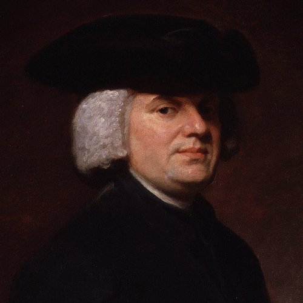

class: middle center

# *Philosophy of Religion*

.red[*reason, faith, belief and doubt*]

George Matthews, Pennsylvania College of Technology

*2020*

---
## *Perspectives on religion*

--

.red[From inside:] what religious beliefs or practices should I adhere to as someone aware of the mysteries of life and death?

--

.red[From outside:] 

--

- **Religious studies:** what are the practices, beleifs and histories of the many different world religions?

--

- **Sociology:** how do religions work as institutions expressing shared values and social meaning?

--

- **Psychology:** what is going on in the mind when people have religious beliefs and engage in religious practices?

--

- **Philosophy:** can religious beliefs be rationally justified?

---
## *Philosophy of religion*

.left-column[

#### .red[metaphysics]

#### epistemology

#### value theory

]

.top-right[

]

--

   

.right-list[

- Does God exist?

]

--

.right-list[

- If so, in what form? As a supernatural being, as identical with nature, as many disemobdied spirits?

]
--

.right-list[

- What does the existence of evil imply about the existence or nature of God or the gods?

]

--

.right-list[

- Is the universe the result of deliberate planning or the result of the blind forces of nature that could easily have been otherwise?

]
---
## *Philosophy of religion*

.left-column[

#### metaphysics

#### .red[epistemology]

#### value theory

]

.top-right[

] 

    

--

.right-list[

- Can we know whether or not a God or gods exist?
]

--

.right-list[

- Are appeals to faith to justify religious belief legitimate?

]

--

.right-list[

- Are science and religion in conflict or are they compatible as two different ways of approaching reality?

]

---
## *Philosophy of religion*

.left-column[

#### metaphysics

#### epistemology

#### .red[value theory]

]

.top-right[

]

    

.right-list[

- What is the relation between religion and morality? 

]

--

.right-list[

- Is religion a purely private matter or does it have any role to play in public life?

]

--

.right-list[

- Should parents be allowed to opt out of scientifically established medical treatments for their kids on religious grounds?

]

---
layout: true
## *Does God exist?*

.left-column[

#### .red[YES]

#### NO

#### MAYBE

]

---

--

.right-column[

**Theism** is the general term for the belief in the existence of a God or gods.

]

--

.right-list[

- Monotheism: there is only one God, and that God is a being with "personhood," with thoughts, feelings, intentions, free will...

]

--

.right-list[

- Polytheism: there are multiple gods often with many different personalities.

]

--

.right-list[

- Pantheism: God is everywhere or in every thing.

]

---

.right-column[

.caution[

Note that actual religions don't always clearly fit these definitions.

]

]

--

.right-list[

- Hinduism is polytheistic, but Krishna is often seen as the main "God" with many other divinities as Krishna's "avatars" or manifestations.

]

--

.right-list[

- Christianity claims that God is *both* unitary *and* has three separate "persons" -- Father, Son and Holy Spirit.

]

---
layout: false
## *Does God exist?*

.left-column[

#### YES

#### .red[NO]

#### MAYBE

]

--

.right-column[

**Atheism** refers to the denial of the existence of God, the gods or a supernatural realm of spirits.

]

--

.right-list[

.caution[

It is sometimes,asserted that it it impossible to "prove a negative," or demonstrate that something does **not** exist or is **not true**. 

But we do this all the time, whenever we show that the existence of something entails a contradiction, or is logically incompatible with other things we know to be true.

]
]

---
## *Does God exist?*

.left-column[

#### YES

#### NO

#### .red[MAYBE]

]

--

.right-column[

**Agnosticism** Is the view that we cannot tell for sure whether or not a God exists.

]

--

.right-list[

.caution[

This is more an *epistemological* than a *metaphysical* view -- it concerns what we can *know* and not what exists.

]

]

--

.right-list[

- Buddhism might be considered an agnostic religion since it has many features of religion, yet often denies that metaphysical claims about the ultimate nature of reality matter.

]

---
layout: false
## *Classic arguments for theism*

.left-column[

  

]

--

.middletext[

 

.left-blurb[

"God is evident in basic facts about the world of our experience."

]
]

--

.right-list[

- Aquinas was an important figure in the history of the Catholic Church.

]

--

.right-list[

- He combined the conceptual framework of Ancient Greek philosophy with Christianity, thus given definitive form to the medieval world-view of the Great Chain of Being, where everything in Nature has its place in a world ruled by God.

]

---
## *Classic arguments for theism*

.left-column[

  

]

.topcap[

The Cosmological Argument

]

.right-argument[

Everything that exists has a cause.

The universe as a whole exists.

***

So the universe as a whole has a cause -- God.

]

--

.right-column[

- The key idea here is that *this* universe exists and that specific things need specific causes. But *must* this cause be the God of Christianity? 

]

---
## *Classic arguments for theism*

.left-column[

  

]

--

.middletext[

 

.left-blurb[

"Reason alone can show us that God *must* exist."

]
]

.right-list[

- Anselm was an early Medieval philosopher convinced of the power of human reason to make sense of things.

]

--

.right-list[

- His most famous argument is a negative argument that shows that God cannot, *not* exist.

]

---
## *Classic arguments for theism*

.left-column[

  

]

.topcap[

The Ontological Argument

]

--

.right-argument[

We can imagine the existence of a perfect being.

But if such a being *did not exist* it would lack something and so be less than perfect.

***

Thus a perfect being must exist -- God.

]

--

.wide-list[

- Something seems fishy here, but it is hard to see what. 

]

--

.wide-list[

- Can such abstract reasoning do more than just restate our original assumption that we *can* imagine such a being?

]

---
## *Classic arguments for theism*

.left-column[

  

]

--

.middletext[

 

.left-blurb[

"The hand of God is visible in the complexity of the natural world."

]
]

.right-list[

- William Paley was an Anglican minister whose "natural theology" was taken to be the best explanation for biological complexity until Darwin challenged it.

]

.right-list[

- His argument is still popular among Christian fundamentalists who use it to oppose evolution.

]

---
## *Classic arguments for theism*

.left-column[

  

]

.topcap[

Paley's Watch

]

.right-argument[

If you found a watch on the beach you'd be right to think it was not a product of chance but of design.

The organisms we "find" in nature are even more complex than a watch.

***

Thus a designer powerful enough to have designed biological organisms must exist -- God.

]

--

.wide-list[

- This argument fails to mention other possible explanations for biological complexity, like the "blind watchmaker" of evolution by natural selection. 

]

---
## *Faith and the limits of reason*

.top-right[

]

--
.left-list[

- None of these arguments seem so convincing to modern readers.

]

--

- Perhaps the Eighteenth Century philosopher Immanuel Kant was right that these kinds of big metaphysical questions cannot be answered in any definite way.

--

- What then about appealing to faith as the basis of religious belief?

--
 

.caution[

Appeals to faith are a double-edged sword. If there are .red[no reasons] offered, only belief, we also have no reason to take such appeals seriously.

]

---
## *Atheism and the problem of evil*

---
## *Pascal's wager*

---
## *Buddhism*

---

layout: false
### *Find out more*
 
: Hank Green explores Anselm's ontological argument in this episode of The Crash Course.

: ore from te crash course, this time dealing with St. Thomas Aquinas' "five ways" to establish the existence of God.

---
class: center credits

#### Credits

*Built with:*

 

 html presentation framework 

*Photos by:*

 and  at Pixabay

[download this presentation](./pdf/02-religion.pdf) or [print it](./pdf/02-religion-print.pdf)

: requires a (free) GitHub account.

