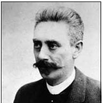
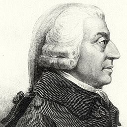
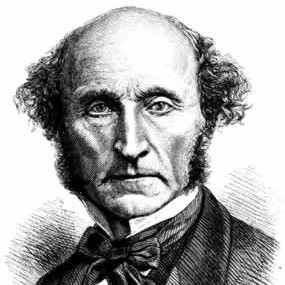
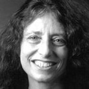

class: middle center

# *Philosophical Ethics*

.red[*debating right and wrong*]

George Matthews, Pennsylvania College of Technology

*2020*

---
layout: true
## *A Moral Dilemma*

---

--

.topcap[the runaway trolley]

.example[

You are standing near a switch next a railroad track when you notice a runaway trolley coming down the tracks in your direction. There are five children playing on the track below too far away to hear you. There is one worker on the other track where the trolley would go if you threw the switch.

]

![:vspace 1]

--

- *Would* you throw the switch?

--

- *Should* you throw the switch?

--

- **WHY?**

---

- It turns out that most people say that they would throw the switch and would even feel an *obligation* to do so.

--

- The principle that seems obviously relevant here is: 
--

![:vspace 1]

.caution[

If you are faced with a situation in which it looks certain that someone will end up hurt, you should do whatever you can to minimize the number of victims.

]

![:vspace 1]

--

But what about another case like this...

---

.topcap[another runaway trolley]

.example[

You are standing on a bridge over a railroad track railroad when you notice a runaway trolley coming down the tracks in your direction. There are five children playing on the track below too far away to hear you. There is a rather large person next to you and if you push him in front of the trolley it will stop the trolley but kill him.

]

![:vspace 1]

--

- In this case most people would say that they would *not* push the large person into the tracks, and even that it would be *wrong* do do this.

--

- Why is this when the results are the same in both cases?

---

- Perhaps there is an *overriding* principle at work here.

--

![:vspace 1]

.caution[

Don't directly cause harm to someone even if it seems like the outcome will be good.

]

![:vspace 1]

--

- But then how can both of our principles be true and what exactly is "directly" causing harm anyway?

--

.red[Philosophical ethics] attempts to answer questions like these and figure out what ethics is all about.

---
layout: false
## *Philosophical Ethics*

--

.topcap[descriptive ethics]

--

.question[

What moral principles do real people follow and how do we explain these principles?

]

![:vspace 1]

--

- The first branch of philosophical ethics is descriptive ethics which attempts to describe and explain how we really think about moral and ethical issues.

--

- Scientists also look at ethics from this perspective, for example, when neuroscientists try to determine what parts of the brain are active when we face different versions of dilemmas like the trolley problem.

---

## *Philosophical Ethics*

--

.topcap[meta-ethics]

--

.question[

Is  morality really just a matter of opinion, or is it subject to rational assessment and validation?

]

![:vspace 1]

--

- The second branch of philosophical ethics is meta-ethics which looks at ethics and its general features, again without taking a stance on what might really be right or wrong?

--

- Meta-ethical questions are about the *status* of ethical claims as compared with other ways of thinking and speaking, and are an important part of the philosophical approach since they concern our basic assumptions about ethics.

---

## *Philosophical Ethics*

--

.topcap[normative ethics]

--

.question[

What moral principles are really justified and what is it that we should actually do in cases like this?

]

![:vspace 1]

--

- The third branch of philosophical ethics is normative or prescriptive ethics which jumps in and takes a position on the issues at hand.

--

- This approach is unique to philosophy since philosophical debate often involves stating a position and defending it. Philosophers are out to find the truth and trust this method of debating to help find it.

---
## Major Moral Theories
- **Relativism**: there are no universal moral principles.

--

- **Virtue Ethics**: morality is about developing our capacities as human beings to the fullest.

--

- **Egoism**: morality is mistaken, we should our ourselves first.

--

- **Utilitarianism**: what is right is what is the best thing for the most people affected.

--

- **Kant's Ethics of Duties**: immoral behavior makes no ultimate sense.

--

- **The Ethics of Care**: morality is not about abstract rules, but about real relationships

---
layout: true
## *Cultural Relativism*

---

--

.left-column[

  

]

--

.middletext[

 

.left-blurb[

"There are many answers to questions of right and wrong."

]
]

--

.right-list[

- Ruth Benedict was an American anthropologist whose encounters with indigenous peoples convinced her that there was no universally valid set of moral principles.

]

--

.right-list[

- For her, culture and community, not reason and humanity, dictate moral principles.

]

--

.wide-list[

- Relativism is a "meta-ethical" claim about the nature of moral thinking and *not* an attempt to justify any particular moral principles.

]

---

.topcap[The argument from cultural differences]

--

.argument[

Different cultures have different views about right and wrong.

***

Thus there are no universal moral principles.

]

![:vspace 10]

--

- This may seem like an obvious argument, but does it follow that there are no principles simply because people may disagree about *what they are*? 

--

- We also disagree about the facts, but it doesn't follow from this that there are no true facts.

---
layout: true
## *Subjective Relativism*
---

--

.left-column[

  

]

--

.middletext[

 

.left-blurb[

"There ain't no sin and there ain't no virtue. There's just stuff people do."

]
]

--

.right-list[

- John Steinbeck's novels often present characters grappling with difficult circumstances which leads some to express bleak views like this.

]

--

.right-list[

- Ultimately the story of "The Grapes of Wrath" shows characters banding together to overcome this idea that "sin" and "virtue" are nothing but subjective opinions.

]

--

.right-list[

- But subjectivism is nevertheless a popular theory.

]

---

.topcap[Facts and values]

--

.argument[

If something is factual it is not subject to debate.

Moral claims are always up for debate.

***

This there are no facts about morality, only personal opinions.

]

![:vspace 10]

--

- This meta-ethical argument may seem compelling at first.

--

- But is it really the case that our deepest moral values are nothing but opinions that might be casually discarded?

--

- There are many reasons to think otherwise as we shall soon see.

---
layout: true
## *Virtue Ethics*
---

--

.left-column[

  

]

--

.middletext[

 

.left-blurb[

"True happiness comes from realizing our natural potential as human beings."

]
]

--

.right-list[

- For Aristotle ethics and morality are not a matter of simply of knowing certain principles, but of the cultivation of character.

]

--

.right-list[

- A good person is one who follows a middle path between extremes -- exhibiting courage and generosity and not either cowardice or fearfulness; or excessive giving or stinginess.

]

--

.wide-list[

- Only by realizing our built-in human capacities can we truly be happy, and this is the goal of an ethical life.

]

---

.topcap[the argument from human nature]

.argument[

By nature we have certain capacities built-in to us, such as the ability to reason and participate in public life.

Its best to follow what nature dictates.

***

Thus we should all try to develop our capacities to the fullest.

]

![:vspace 10]

--

- Aristotle recommends that we strive to "be all we can be" since that is what humans are "meant to do."

--

- What if I choose *not to* strive for excellence? Is that wrong?

--

- And what is "human nature" anyway?

---
layout: true
## *Egoism*
---

--

.left-column[

  

]

--

.middletext[

 

.left-blurb[

"We owe each other nothing, for what I seem to owe you I owe at most to myself."

]
]

--

.right-list[

- Max Stirner backed a view called "psychological egoism" which claims that "selfless good deeds" are impossible because we always have hidden selfish motives even when we seem to be doing things for others.

]

--

.wide-list[

- .red[Psychological egoists] claim that we can find hidden motives in *anything* anyone does, no matter how selfless it seems, but does that prove that we really can't take others into account?

]

---

.left-column[

  

]

--

.middletext[

 

.left-blurb[

"Each pursuing his or her private gain brings about the public good by means of the 'invisible hand' of the marketplace."

]
]

--

.right-list[

- Adam Smith was a philosopher and economist who is often credited as the founder of capitalism.

]

--

.right-list[

- He claimed that free economic markets where everyone is out for their own gain lead to the best outcomes for everyone.

]

--

.wide-list[

- .red[Ethical egoists] extend this claim to assert that it is *always* best to look out for ourselves and that by similar mechanisms the good of all will take care of itself.

]

---
.topcap[an argument for psychological egoism]

.argument[

Each one of us can only make decisions for ourselves.

***

Thus all of our decisions are by definition selfish.

]

![:vspace 10]

--

- This simple argument is what leads some people to declare that there just are no "selfless good deeds" to be found anywhere.

--

- But does this follow? Can't we be concerned with others even if we often have *mixed* motives, partly concerned with others and partly self-centered?

---
.topcap[an argument for ethical egoism]

.argument[

Competition brings out the best in us -- it gives us incentives to do and be better at whatever we do.

Helping others undermines competition and destroys incentives.

***

So we should never help others.

]

![:vspace 10]

--

- This is a common argument against social welfare programs, that they undermine incentives.

--

- Competition can bring out the best in us, but it is fragile. In sports, the *worst* teams not the best get the best players in the annual draft since otherwise there would soon be no competition.

--

- Egoism overlooks how much a concern for others is a part of who we are.

---
layout: true
## *Utilitarianism*
---

--

.left-column[

   

]

--

.middletext[

  

.left-blurb[

"Actions are right in the proportion as they tend to promote happiness, wrong as they tend to produce the reverse of happiness."

]
]

--

.right-list[

- John Stuart Mill approaches ethical and moral questions from a practical perspective: what matters is how much good we do.

]

--

.right-list[

- As a pioneering economist he was also convinced that the "costs" and "benefits" of our actions and decisions could be measured, compared and anticipated.

]

---

.topcap[an argument for utilitarianism]

.argument[

We are all after the same thing -- happiness.

Nobody's happiness counts for more than anybody else's.

***

Thus we should all act so as to increase the overall amount of happiness, to promote the best outcome for the most people.

]

--

- Why should each of us accept that all of us count equally?

--

- One response: there is no reason to think otherwise, why should my interests matter more than yours if we are both after the same goal of being happy?

---

.topcap[difficulties with utilitarianism]

--

- Can we really measure happiness and compare each other's happiness on a neutral scale as utilitarianism requires?

--

- How long into the future do consequences still matter?

--

- Can we even really predict the consequences of our actions?

--

- Do good outcomes *really* determine the rightness of what we do? Anything would seem to be permissible if it led to the "greater good" of more happiness for more people.

---
layout: true
## *Kant's Ethics of Duty*
---

--

.left-column[

   

]

--

.middletext[

  

.left-blurb[

"Always treat others as ends in themselves, not merely as a means to an end."

]
]

--

.right-list[

- Immanuel Kant's ethics of duty asks: on what basis do we have obligations to each other?

]

--

.right-list[

- His answer is that obligations rest on reason alone in that anyone who thinks things through carefully will realize that all of us deserve basic respect and should never be treated as objects to be exploited or used.

]

---

.topcap[the rational basis of respect]

.argument[

Lying, cheating, stealing, etc. are all based on a double standard.

When I do these I expect that you won't do them back.

***

Rationality requires consistency, so these kinds of things are irrational to do.

]

--

- Stealing is wrong since when I steal I expect others to respect my property, but opt out of respecting theirs.

--

- Lying is wrong since when I lie I expect others to believe me while opting out of telling them the truth.

---

.topcap[rights and duties]

--

- Kant's argument here is that all immoral behavior rests on an inner disharmony.

--

- In all cases, I assume and demand respect from others (that they should tell me the truth, respect my property, not harm me), while disrespecting others by using them as a means to me ends.

--

- The only way to live a self-consistent life is to treat others as I expect and demand others to treat me.

--

- From this perspective the concepts of human rights, and our duties to each other are not based on authority, convenience or usefulness, but on simple consistency.

---
layout: true
## *The Ethics of Care*
---

--

.left-column[

   

]

--

.middletext[

  

.left-blurb[

"Caring requires paying attention, seeing, listening, responding with respect."

]
]

--

 

.right-list[

- Carol Gilligan noted that theories of moral development labelled women's responses to moral dilemmas inadequate since they focused on relationships and not universal principles.
]

--

.right-list[

- She proposed that women typically speak in a "different voice" on moral issues than men typically use.

]

--

.wide-list[

"Male" moral voices emphasize universal principles, while "female" moral voices emphasize concern for particular relationships.

]

---

.topcap[taking gender seriously]

--

.argument[

Men and women typically address moral issues in different terms.

Both perspectives are equally valid.

***

So we should allow both voices to participate in discussions of morality.

]

--

- Are these different gendered perspectives "built-in" to men and women or they based on roles learned in a particular society?

--

- How can we balance universal concerns for human rights and equality with the demands of particular relationships based on care for individuals?

---
layout: false
### *Find out more*

: a free textbook edited by George Matthews with essays on major approaches to philosophical ethics.

: Michael Sandel of Harvard University teaches one of the most popular courses at Harvard and makes videos of his lectures available at his website.

: Hank Green's series contains several videos exploring various approaches to ethics.

---
class: center credits

 

#### Credits

*Built with:*

 

 html presentation framework 

*Photos by:*

[download this presentation](./pdf/03-slides.pdf) or [print it](./pdf/03-handout.pdf)

: requires a (free) GitHub account.

