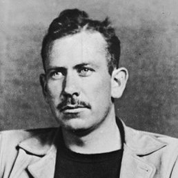
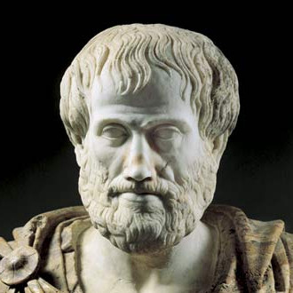

class: middle center

# *Philosophical Ethics*

.red[*debating right and wrong*

*[under construction]* ]

<!--  -->

George Matthews, Pennsylvania College of Technology

*2020*

---
layout: true
## *A Moral Dilemma*

---

--

.topcap[the runaway trolley]

.example[

You are standing near a switch next a railroad track when you notice a runaway trolley coming down the tracks in your direction. There are five children playing on the track below too far away to hear you. There is one worker on the other track where the trolley would go if you threw the switch.

]

--

- *Would* you throw the switch?

--

- *Should* you throw the switch?

--

- **WHY?**

---

- It turns out that most people say that they would throw the switch and would even feel an *obligation* to do so.

--

- The principle that seems obviously relevant here is:

--

.caution[

If you are faced with a situation in which it looks certain that someone will end up hurt, you should do whatever you can to minimize the number of victims.

]

--

But what about another case like this...

---

.topcap[another runaway trolley]

.example[

You are standing on a bridge over a railroad track railroad when you notice a runaway trolley coming down the tracks in your direction. There are five children playing on the track below too far away to hear you. There is a rather large person next to you and if you push him in front of the trolley it will stop the trolley but kill him.

]

--

- In this case most people would say that they would *not* push the large person into the tracks, and even that it would be *wrong* do do this.

--

- Why is this when the results are the same in both cases?

---

- Perhaps there is an *overriding* principle at work here.

--

.caution[

Don't directly cause harm to someone even if it seems like the outcome will be good.

]

--

- But then how can both of our principles be true and what exactly is "directly" causing harm anyway?

--

.red[Philosophical ethics] attempts to answer questions like these and figure out what ethics is all about.

---
layout: false
## *Philosophical Ethics*

--

.topcap[descriptive ethics]

--

.question[

- What moral principles do real people follow and how do we explain these principles?

]

--

- The first branch of philosophical ethics is descriptive ethics which attempts to describe and explain how we really think about moral and ethical issues.

--

- Scientists also look at ethics from this perspective, for example, when neuroscientists try to determine what parts of the brain are active when we face different versions of dilemmas like the trolley problem.

---

## *Philosophical Ethics*

--

.topcap[meta-ethics]

--

.question[

- Is  morality really just a matter of opinion, or is it subject to rational assessment and validation?

]

--

- The second branch of philosophical ethics is meta-ethics which looks at ethics and its general features, again without taking a stance on what might really be right or wrong?

--

- Meta-ethical questions are about the *status* of ethical claims as compared with other ways of thinking and speaking, and are an important part of the philosophical approach since they concern our basic assumptions about ethics.

---

## *Philosophical Ethics*

--

.topcap[normative ethics]

--

.question[

- What moral principles are really justified and what is it that we should actually do in cases like this?

]

--

- The third branch of philosophical ethics is normative or prescripive ethics which jumps right into debates about right and wrong and takes a position principles and particular cases.

--

- This approach is unique to philosophy since philosophy is not always just a neutral analysis of ideas, but also involves stating a position and defending it. This is the side f philosophy that is actively engaged with its subject matter and not just looking on from the sidelines.

---
## Major Moral Theories
1. **Relativism**: there are no universal moral principles.

--

2. **Virtue Ethics**: morality is about developing our capacities as human beings to the fullest.

--

3. **Utilitarianism**: what is right is what is the best thing for the most people affected.

--

4. **Egoism**: morality is mistaken, we should our ourselves first.

--

5. **Kant's Ethics of Duties**: immoral behavior makes no ultimate sense.

--

6. **The Ethics of Care**: morality is not about abstract rules, but about real relationships

---
layout: true
## *Cultural Relativism*

---

--

.left-column[

  

]

--

.middletext[

 

.left-blurb[

"There are many answers to questions of right and wrong."

]
]

--

.right-list[

- Ruth Benedict was an American anthrpologist whose encounters with indigeous peoples convinced her that there was no universally valid set of moral principles.

]

--

.right-list[

- For her, culture and community, not reason and humanity, dictate moral principles.

]

--

.wide-list[

- Relativism is a "meta-ethical" claim about the nature of moral thinking and *not* an attempt to justify any particular moral principles.

]

---

.topcap[The argument from cultural differences]

--

.argument[

Different cultures have different views about right and wrong.

***

Thus there are no universal moral principles.

]

--

- This may seem like an obvious argument, but does it follow that there are no principles simply because people may disagree about *what they are*? 

--

- We also disagree about the facts, but it doesn't follow from this that there are no true facts.

---
layout: true
## *Subjective Relativism*
---

--

.left-column[

  

]

--

.middletext[

 

.left-blurb[

"There ain't no sin and there ain't no virtue. There's just stuff people do."

]
]

--

.right-list[

- John Steinbeck's novels often present characters grappling with difficult circumstances which leads some to express bleak views like this.

]

--

.right-list[

- Ultimately the story of "The Grapes of Wrath" shows characters banding together to overcome this idea that "sin" and "virtue" are nothing but subjective opinions.

]

--

.right-list[

- But subjectivism is nevertheless a popular theory.

]

---

.topcap[Facts and values]

--

.argument[

If something is factual it is not subject to debate.

Moral claims are always up for debate.

***

This there are no facts about morality, only personal opinions.

]

--

- This meta-ethical argument may seem compelling at first.

--

- But is it really the case that our deepest moral values are nothing but opinions that might be casually discarded?

--

- There are many reasons to think otherwise as we shall soon see.

---
layout: true
## *Virtue Ethics*
---

--

.left-column[

  

]

--

.middletext[

 

.left-blurb[

"True happiness comes from realizing our natural potential as human beings."

]
]

--

.right-list[

- For Aristotle ethics and morality are not a matter of simply of knowing certain principles, but of the cultivation of character.

]

--

.right-list[

- A good person is one who follows a middle path between extremes -- exhibiting courage and generosity and not either cowardice or fearfulness; or excessive giving or stinginess.

]

--

.right-list[

- Only by realizing our built-in human capacities can we truly be happy, and this is the goal of an ethical life.

]

---

---
layout: false
### *Find out more*

---
class: center credits

 

#### Credits

*Built with:*

 

 html presentation framework 

*Photos by:*

[download this presentation](./pdf/03-slides.pdf) or [print it](./pdf/03-handout.pdf)

: requires a (free) GitHub account.

