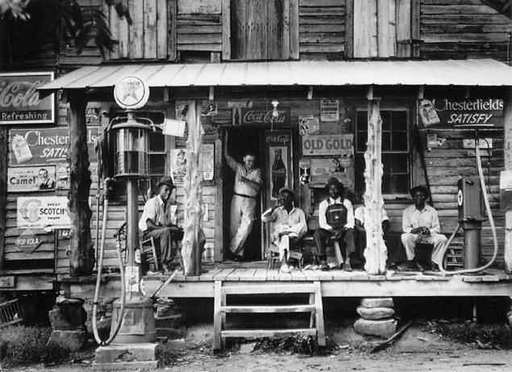
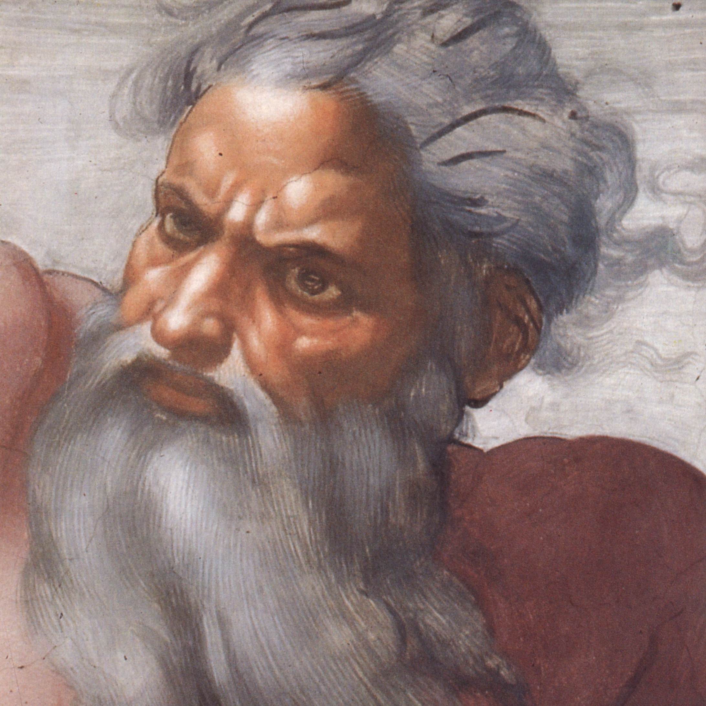

class: middle center

# *Philosophical Ethics*

.red[*debating right and wrong*]

<!--  -->

George Matthews, Pennsylvania College of Technology

*2020*

---
## *The Runaway Traincar*

---
layout: false
## *Cultural Relativism*

.left-column[

  

]

--

.middletext[

 

.left-blurb[

"There are many answers to questions of right and wrong."

]
]

--

.right-list[

- Ruth Benedict was an American anthrpologist whose encounters with indigeous peoples convinced her that there was no universally valid set of moral principles.

]

--

.right-list[

- For her, culture and community, not reason and humanity, dictate moral principles.

]

---
layout: false
## *Cultural Relativism*

.left-column[

  

]

--

.topcap[The argument from cultural differences]

--

 

.right-argument[

Different cultures have different views about right and wrong.

***

Thus there are no universal moral principles.

]

--

.wide-list[

- This may seem like an obvious argument, and yet...

]

--

.wide-list[

- Does it really follow that there are no principles simply because people may disagree about *what they are*? We disagree about many things, but that doesn't establish that there are no facts.

]

--

---
layout: false
## *Divine Command Theory*

.left-column[

  

]

--

.middletext[

 

.left-blurb[

"Thou shalt not kill!"

]
]

--

.right-list[

- This theory is popular among those who see religion as providing an authoritative set of moral principles.

]

--

.right-list[

- It offers an account of the meaning of moral principles -- they are to be understood as commands issued by a supreme being.

]

---

layout: false
### *Find out more*

---
class: center credits

 

#### Credits

*Built with:*

 

 html presentation framework 

<!-- *Photos by:* -->

[download this presentation](./pdf/03-slides.pdf) or [print it](./pdf/03-handout.pdf)

: requires a (free) GitHub account.

