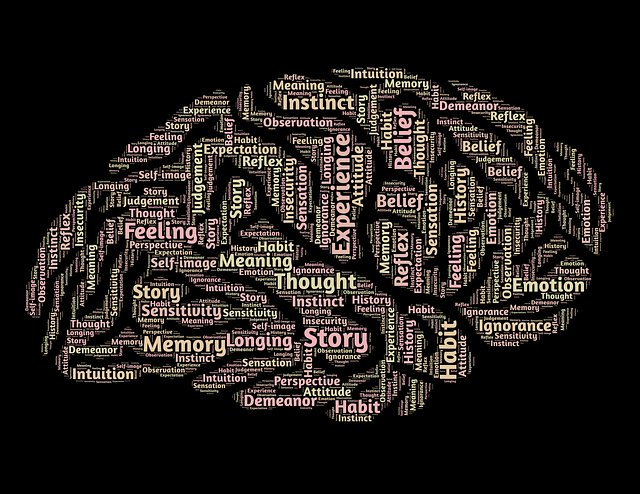
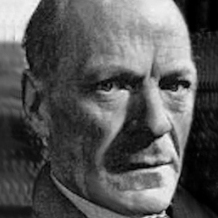
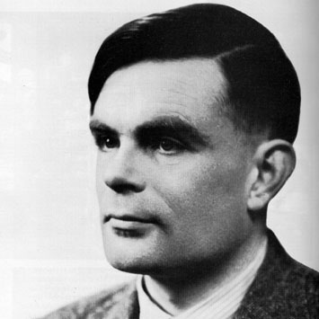
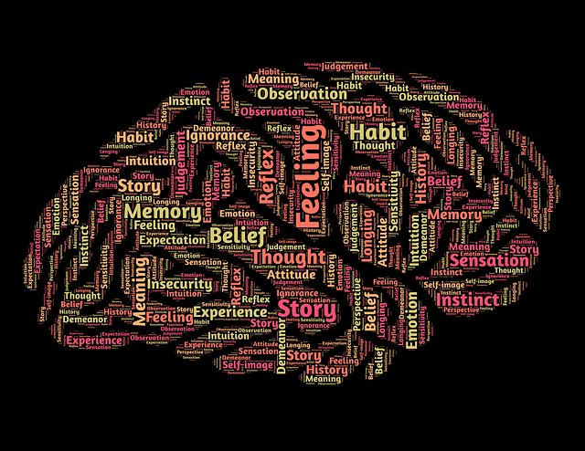

class: middle center

# *Philosophy of Mind*

.red[*minds in a material world*]

George Matthews, Pennsylvania College of Technology

*2020*

---
## *The Mind/Body Problem*

--

.question[

  What is the place of the mind and mental phenomena in the physical universe?

]

--

- The mind/body problem is a metaphysical issue since it concerns the basic sorts of things that exist.

--

- In this slideshow we examine the major ways of addressing this problem that have been arisen since the scientific revolution first challenged the ancient belief in the existence of the soul.

--

- We'll do this by looking at major theoretical approaches and what might be said both in favor of and against them.

---
## *The Mind/Body Problem*

.question[

  What is the place of the mind and mental phenomena in the physical universe?

]

--

- .red[Dualism]: minds and bodies are two entirely separate things, so minds are NOT a part of the physical universe at all.

--

- .red[Behaviorism]: minds are nothing but certain patterns of behavior which we refer to as intelligent.

--

- .red[Mind/Brain Identity Theory]: minds are collections of states of the physical brain.

--

- .red[Functionalism]: minds are the software or sets of functions, carried out by the components of physical brains.

---
## *The Case for Dualism*

--

.left-column[

]

.middletext[

.left-blurb[

"Minds and bodies are so different that they must be different kinds of things entirely."

]
]

--

.right-list[

- Descartes offers a defense of the traditional conception of the soul as an immaterial entity.

]

--

.right-list[

- Mental and physical things seem to share no features in common, so he argues that they must belong to entirely different "worlds."

]

--

.wide-list[

- Physical things are publicly observable, take up space and interact according to the laws of physics, while none of this is true of "mental things" like thoughts, dreams or feelings.

]

---
## *Objections to Dualism*

--

.left-column[

]

.middletext[

.left-blurb[

"If minds and bodies are so different how can they interact?"

]
]

--

.right-list[

- Princess Elizabeth of Bohemia exchanged many letters with Descartes in which she stressed what has come to be known as "the interaction problem."

]

--

.right-list[

- Clearly my mind interacts with my body, yet dualism seems to rule this out as even a possibility.

]

---
## *Objections to Dualism*

.left-column[

]

.middletext[

.left-blurb[

"Talking about minds as separate things gets it all wrong."

]
]

--

.right-list[

- Gilbert Ryle offers a diagnosis of where Descartes went wrong. He thought of the mind as a kind of "thing" and not as a "higher-order" description of what certain kinds of creatures *with* minds do.

]

--

.right-list[

- Just like we'd be wrong to seek "the desert" alongside of all the cactus, lizards and sand in Nevada, we are mistaken to look for a "mind" alongside our bodily parts.

]

---
## *The Case for Behaviorism*

--

.left-column[

]

.middletext[

.left-blurb[

"Psychology is a branch of objective, natural science, which aims at prediction and control."

]
]

--

.right-list[

- Watson and other early psychologists sought to define what a scientific psychology would look like.

]

--

.right-list[

- Behaviorists claimed that rather than "looking inside" and observing our minds we should study how creatures *with* minds behave -- proof of understanding would be the ability to predict and control their behavior.

]

--

.wide-list[

- This led to the philosophical view that minds just *were* certain kinds of behavior.

]

---
## *Objections to Behaviorism*

--

.left-column[

]

.middletext[

.left-blurb[

"Behavior and state of mind are not necessarily the same."

]
]

--

.right-list[

- If you can *act* like you are happy but not really be happy, or *pretend* not to feel pain when you have just cut yourself, your state of mind cannot be the same as your behavior.

]

--

.right-list[

- But since my state of mind is unknown to anyone else but me, how *can* we study the mind scientifically?

]

--

.wide-list[

- Can we predict and control human behavior like we can predict and control things in the physical world? The American philosopher Hilary Putnam had his doubts.

]

---
## *The Case for Mind/Brain Identity Theory*

--

.left-column[

]

.middletext[

.left-blurb[

"All reality is physical, so minds must be states of physical brains."

]
]

--

.right-list[

- The connection between minds and brains has been known since ancient times. Maybe learning all about the brain is all we need to do to understand the mind.

]

--

.right-list[

- J.J.C. Smart and other "physicalists" have argued that minds must *be identical with* brains since physical reality is all that there is.

]

--

.wide-list[

- Recent advances in brain imaging technology would seem to finally give us a way of peering into other people's minds in real time.

]

---
## *Objections to Mind/Brain Identity Theory*

--

.left-column[

]

.middletext[

.left-blurb[

"Many states of the brain might realize one and the same mental state."

]
]

--

.right-list[

- While brains are clearly relevant for minds, American philosopher Jerry Fodor was not sure it made sense to equate the two.

]

--

.right-list[

- After all our brains are all very different in their details and yet we can all think similar thoughts. 

]

--

.wide-list[

- Thus while brain imaging technology can show exactly what my brain is doing, that doesn't mean it can be used to read my mind.

]

---
## *Objections to Mind/Brain Identity Theory*

.left-column[

]

.middletext[

.left-blurb[

"We cannot know from outside what experience is like from inside."

]
]

--

.right-list[

- Australian philosopher Frank Jackson goes further by arguing that any account of the physical brain from "outside" must miss something essential to having a mind, "what it is like" to experience what we experience.

]

--

.wide-list[

- So, for example, a visually impaired scientist with no color vision might know all of the facts about human color vision, but there would be something else she would learn about it should her color vision be restored.

]

---
## *The Case for Functionalism*

--

.left-column[

]

.middletext[

.left-blurb[

"Mind is to software as brain is to hardware."

]
]

--

.right-list[

- If minds are like the "software" running in the "hardware" of our brains, then minds would depend on brains, and need brains to exist, while still not being the *same thing* as brains.

]

--

.right-list[

- This view of the nature of the mind as a set of "information processing functions" carried out by the physical machinery of the brain and nervous system is widely shared by cognitive scientists.

]

---
## *Objections to Functionalism*

--

.left-column[

]

.middletext[

.left-blurb[

"It makes no sense to say the mind is a result of the brain's information processing activity."

]
]

--

.right-list[

- Ned Block offers a colorful example to show why functionalism might not get things right about the mind.

]

--

.right-list[

- If we imagined all one billion citizens of China playing the roles of individual neurons in the human brain and passing signals back and forth just as neurons do we'd never say that somehow the citizens of China *really are* something with a mind.

]

--

.wide-list[

- Thus, minds must be something more than sets of functions carried out by brains.

]

---
## *Objections to Functionalism*

.left-column[

]

.middletext[

.left-blurb[

"Conscious experience cannot be explained in objective terms."

]
]

--

.right-list[

- David Chalmers also asks us to imagine a fictional scenario in his attack on functionalism.

]

--

.right-list[

- We can imagine a "philosophical zombie" processing all of the information we process while being empty of any conscious experience.

]

--

.right-list[

- Such a mythical creature shows that minds are more than information processing.

]

---
## *The Case for Artificial Intelligence*

--

.left-column[

]

.middletext[

.left-blurb[

"Thinking is computation, and we can build a computing machine that can carry out any computation."

]
]

--

.right-list[

- One consequence of functionalism is that Artificial Intelligence *should be possible.*

]

--

.right-list[

- Computer pioneer Alan Turing saw this in the 1930's when he proved that it was possible to build a "universal machine" which could carry out any possible set of instructions thus giving rise to the age of computers.

]

--

.wide-list[

- Contemporary research into Artificial Intelligence is seeking ways to capture the complexity of human thinking in equally complex computer programs.

]

---
## *Against Artificial Intelligence*

--

.left-column[

]

.middletext[

.left-blurb[

"Manipulating symbols according to rules is not the same as thinking."

]
]

--

.right-list[

- John Searle is an American philosopher who argues that Artificial Intelligence is just not possible.

]

--

.right-list[

- He argues that since all computers can ever do is manipulate symbols according to rules with no understanding of the meaning of those symbols, they will always fail to grasp meaning as human being can.

]

--

.wide-list[

- Thus while we may produce convincing "fake" intelligence,  the prospect of computers actually having minds that grasp meanings is forever beyond our reach.

]

---
## *Open Questions*

--

The rise of information technology has brought to the forefront philosophical questions about the nature of minds and many questions remain topics of active research and debate.

--

.question[

What is the basis of the "meanings" of the symbols we use to think and communicate?

]

--

.question[

What is consciousness and how do some physical systems, like human beings, manage to "wake up" and have a fully conscious "inner life?"

]

--

.question[

Can we build a machine that can really count as truly intelligent?

]

---

layout: false
### *Find out more*

 This Crash Course video briefly explains the Mind/Body problem.

: another great Crash Course video on philosophical problems related to the concept of Artificial Intelligence.

: this School of Life video describes three different concepts of Artificial Intelligence and the prospects for building a mind in the real world.

---
class: center credits

#### Credits

*Built with:*

 

 html presentation framework 

*Images by:*

 at Pixabay.

[download this presentation](./pdf/04-slides.pdf) or [print it](./pdf/04-handout.pdf)

: requires a (free) GitHub account.

