class: middle center

# *Freedom and Determinism*

.red[*How can we be free in a world of causes?*]

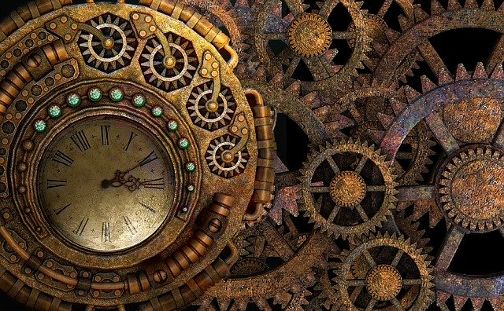

George Matthews, Pennsylvania College of Technology

*2020*

---
layout: true

### *Living in the Material World*

.left-column[

![:vspace 130]

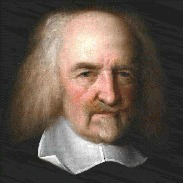

]

---

--

.middletext[

![:vspace 130]

.left-blurb[

"What is the heart but a spring, and the nerves but so many strings and the joints but so many wheels giving motion to the whole body?"

]
]

--

.right-list[

- Hobbes was an early materialist who sought mechanistic explanations for everything humans did.

]

--

.right-list[

- Hobbes' account of the origins of society assumes only that we each seek our own gain and will only cooperate if forced to do so.

]

--

.wide-list[

- In spite of this he does appeal to our ability to *freely choose* to create a society as the moral foundation of the social order. This raises a difficult question...

]

---
layout: true

### *The Puzzle of Freedom*

---

--

---

![:vspace 170]

.question[

Each of these claims seems to be true on its own, but can they all be true **_at the same time?_** It is hard to see how.

]

---

![:vspace 170]

.argument[

Either we are caused, but not free; free but not caused; or somehow free and caused at the same time. This gives us three philosophical strategies for discussing freedom.

]

---

![:vspace 170]

.argument[

.red[Determinism] accepts that everything has a cause and that causes and freedom are incompatible, and so **denies that we are really free.**

]

---

![:vspace 170]

.argument[

.red[Libertarianism] accepts that we are free and that causes and freedom are incompatible, and so **denies that everything has a cause.**

]

---

![:vspace 170]

.argument[

.red[Compatibilism] accepts that we are free and that everything has a cause, and so **denies that causes and freedom are incompatible.**

]

---
layout: true

### *What's at stake*

---

--

.topcap[Freedom is important]

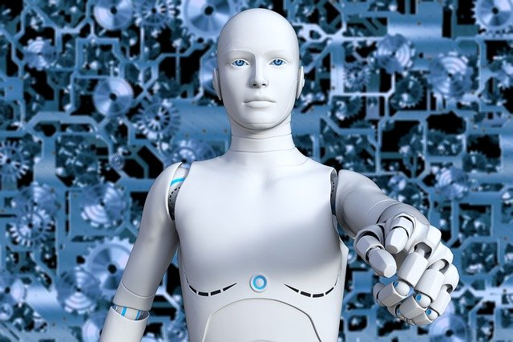

--

- Our lives seem to unfold as a series of real choices.

--

- We hold people responsible for many of their actions and that assumes that they *had* a choice in each case.

--

- Life would seem meaningless without the ability to choose.

---

.topcap[Freedom is mysterious]

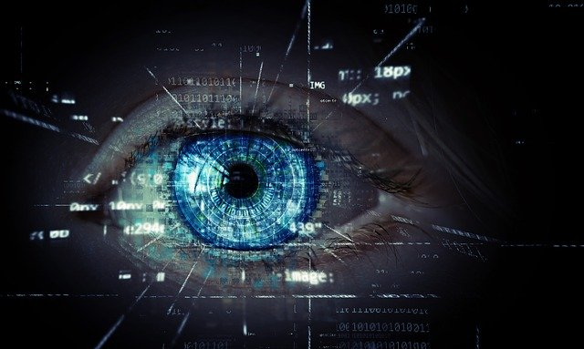

--

- Whatever happens seems to have a cause.

--

- Explaining *anything* seems to involve showing why it had to happen, the mechanisms behind the scenes.

--

- As scientific understanding progresses we may seem more and more like complex machines.

---
layout: false

### *Determinism*

--

.left-column[

![:vspace 130]

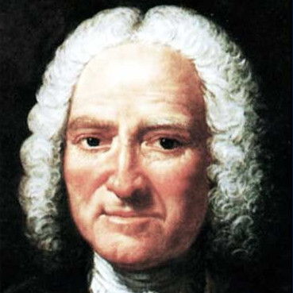

]

--

.middletext[

![:vspace 130]

.left-blurb[

"Man's life is a line that nature commands him to describe upon the surface of the earth without him ever being able to swerve from it."

]
]

--

.right-list[

- Holbach was impressed by the successes of physics at predicting the motion of objects and foresaw the extension of these successes to explanations of human beings.

]

--

.right-list[

- For him, our sense of freedom is an illusion, a result of us not knowing what causes us to do what we do.

]

--

.wide-list[

- Does it even make sense to *argue* about determinism? If the answer we find compelling is pre-determined why bother saying anything at all?

]

---
layout: false

### *Libertarianism*

--

.left-column[

![:vspace 130]

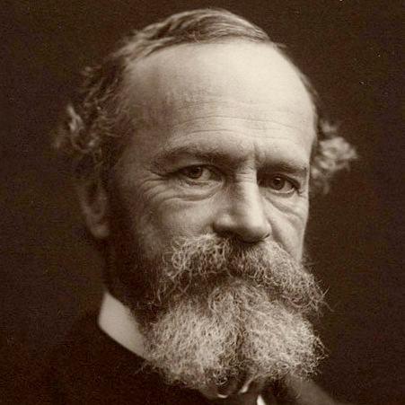

]

--

.middletext[

![:vspace 130]

.left-blurb[

"Of two alternative futures ... both may now be really possible, and the one becomes impossible only [when] the other excludes it by becoming real."

]
]

--

.right-list[

- Libertarians like James defend our common-sense understanding of ourselves as free agents.

]

--

.right-list[

- We experience ourselves as making choices and not as being caused to pick one option over another.

]

--

.wide-list[

- And yet we may wonder whether we can trust our experiences of ourselves. Doesn't science often show us the previously hidden causes of things in our experience?

]

---
layout: false

### *Compatibilism*

--

.left-column[

![:vspace 130]

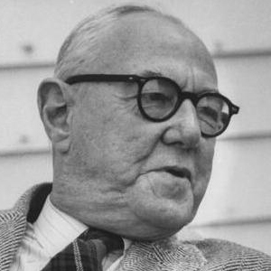

]

--

.middletext[

![:vspace 130]

.left-blurb[

"Acts freely done are those acts whose immediate causes are the psychological state in the agent. Acts not freely done [have causes] external to the agent."

]
]

--

.right-list[

- Stace offers a distinction between two ways we might be caused as a way out of the debate between determinism and libertarianism.

]

--

.right-list[

- When we are not free we are caused to do things by external forces; when we are free we *cause ourselves* to certain things.

]

--

.wide-list[

- Does this account of human freedom simply offer one mystery in place of another? Let's look more closely...

]

---
layout: true

### *Reasons and causes*

---

--

.caution[

Maybe the debate about freedom and determinism is the wrong debate.

]

--

- We can be *caused* to do things in a variety of ways, pushed by internal and external forces acting on us.

--

- Some of these involve having *good reasons* to do one thing or another.

--

- Is this is the key to understanding how and when we are free?

--

![:vspace 50]

.red[Consider some examples...]

---

.leftbar[

]

.middlebar[

.left-blurb[

I am not going to work today because I quit.

]

]

--

.middlebar[

.right-blurb[

I am not going to work today because I got fired.

]

]

.rightbar[

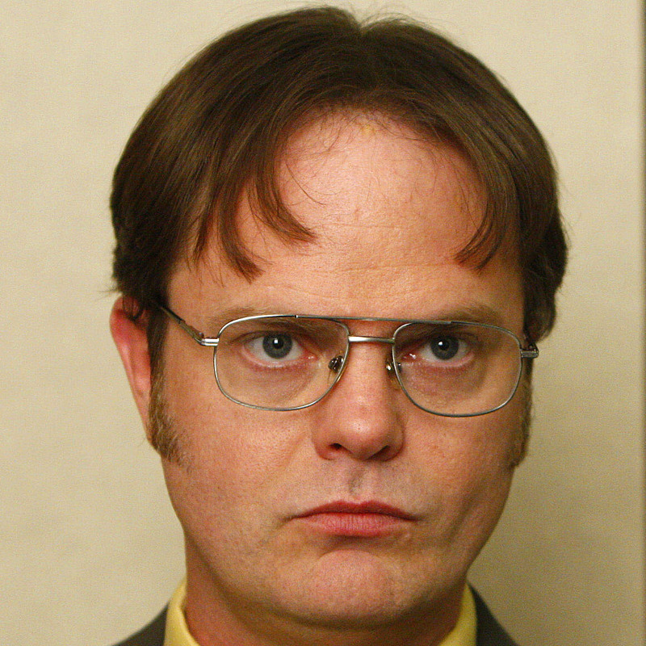

]

--

---

.leftbar[

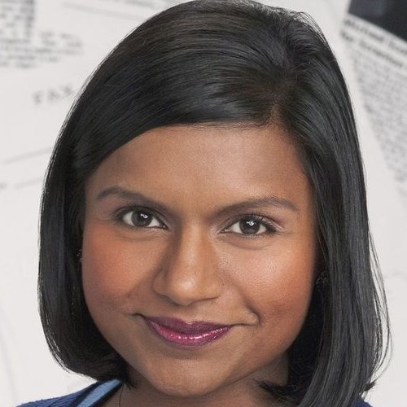

]

.middlebar[

.left-blurb[

I gave money to charity because I wanted to help.

]

]

--

.middlebar[

.right-blurb[

I gave money to the man who pointed a gun at me.

]

]

.rightbar[

]

--

---

.leftbar[

]

.middlebar[

.left-blurb[

I take drugs because I want to relax after a long day at work.

]

]

--

.middlebar[

.right-blurb[

I take drugs because I am hopelessly addicted and can't stop myself.

]

]

.rightbar[

]

--

---
layout: false

### *Free will?*

--

.question[

The idea that we have something called free will is difficult to explain. What might possibility explain our ability to initiate actions freely while nothing else that exists seems to have this power?

]

--

- Traditionally it was held to be a special power of the human soul, that which connects us with the being who most exemplifies free will, God.

--

- Many scientists doubt that such a power exists and so refer to freedom as an illusion, similar to the illusion that the sun moves in the sky while in fact it is the earth that moves on its own axis. 

--

.red[But what then about legal and moral concepts of freedom that seem essential to our social lives and understanding of ourselves?]

---
layout: false

### *Free won't!*

--

.question[

Maybe we should instead talk about "free won't. After all don't we act freely when we learn to say "no" to our own worst impulses?

]

--

- Human freedom depends on the region at the front of the brain called the "pre-frontal cortex" which serves to *prevent* impulses to act from going further. 

--

- Many streams of brain activity, ranging from our instinctual and emotional impulses to our symbolic reasoning, converge here giving us the ability to filter out some impulses and pursue some others based on conscious thought processes.

--

- Responsible adults are presumed to be able to make delibarate choices in this way.

---
layout: false

### *Existentialism and freedom*

--

.left-column[

![:vspace 130]

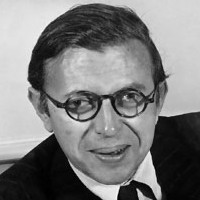

]

--

.middletext[

![:vspace 130]

.left-blurb[

"Freedom is what you do with what's been done to you."

]
]

--

.right-list[

- Sartre's existentialism focuses on our experiences of our lives as we live them "from inside."

]

--

.right-list[

- For Sartre free action is action that we use to make meaning out of the predicaments we find ourselves, to take what is *given* to us by circumstances and make it *our own.*.

]

--

.wide-list[

- Living *autonomously* is a never-ending project of critically reflecting on the causes and conditions which make possible and contrain our lives.

]

---
layout: false
### *Find out more*

---
class: center credits

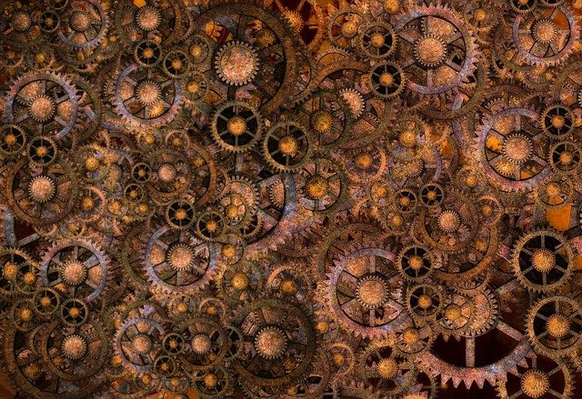

#### Credits

*Built with:*

 

 html presentation framework 

*Images by:*

, 

[download this presentation](./pdf/05-slides.pdf) or [print it](./pdf/05-handout.pdf)

: requires a (free) GitHub account.

