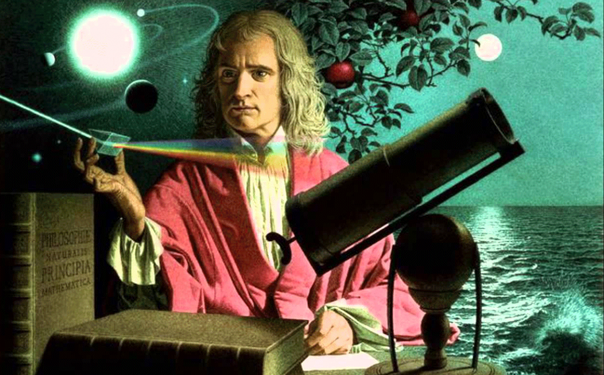
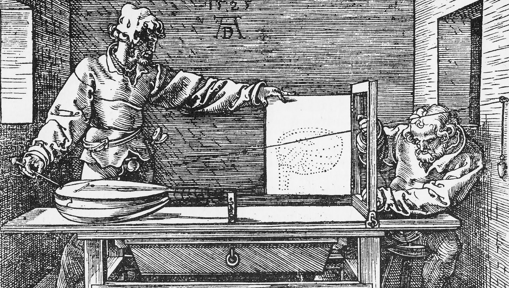
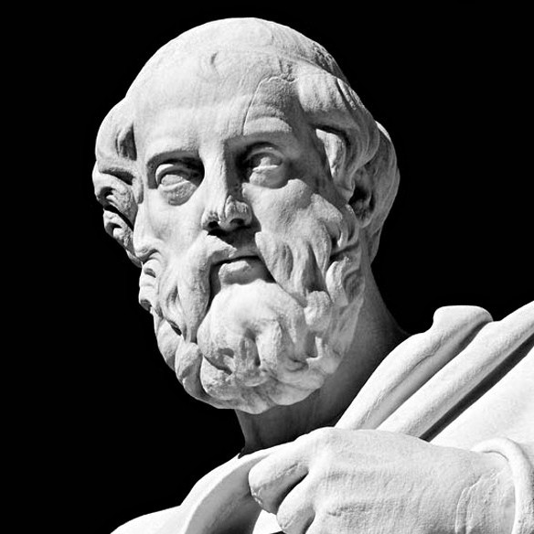
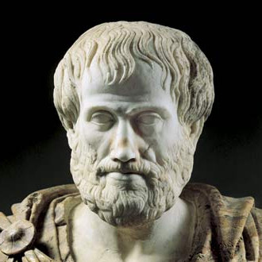
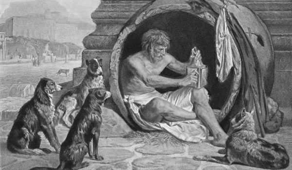
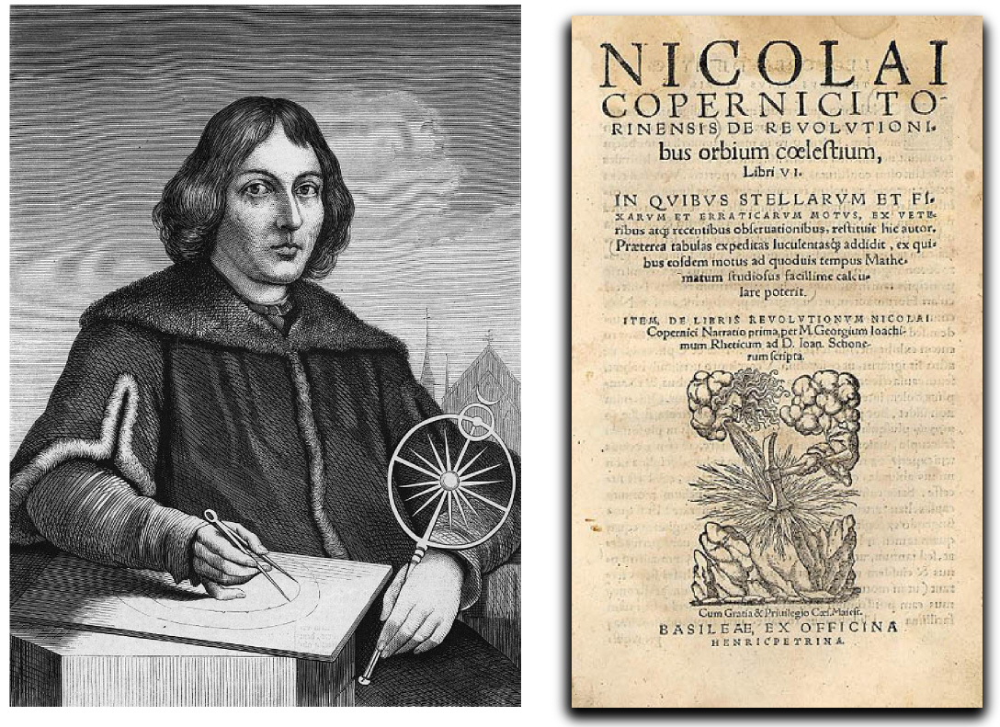
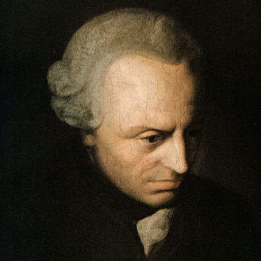

class: middle center

# *Knowledge and Skepticism*

.red[*What can we really know?*]

George Matthews, Pennsylvania College of Technology

*2020*

---
layout: true

### *What do I know?*

---

.left-column[

#### .fade-in[Knowledge is]

#### .fade-out[justified,]

#### .fade-out[true,]

#### .fade-out[belief.]

]

.right-column[

]

---

.left-column[

#### .fade-in[Knowledge is]

#### .fade-out[justified,]

#### .fade-out[true,]

#### .alert[belief.]

]

.right-list[

]

.wide-list[

- How can we know anything at all? This ancient philosophical question has troubled many people.

]

--

.wide-list[

- First, note that knowledge is a state of mind, a type of *belief.* But there's more to knowledge than just belief.

]

---

.left-column[

#### .fade-in[Knowledge is]

#### .fade-out[justified,]

#### .alert[true,]

#### .fade-in[belief.]

]

.right-list[

]

--

.wide-list[

- To count as knowledge our beliefs also have to be *true.* 

]

--

.wide-list[

- While it may be hard to figure out just what the facts are, simply believing something strongly is not enough to make it true or make it count as knowledge.

]

---

.left-column[

#### .fade-in[Knowledge is]

#### .alert[justified,]

#### .fade-in[true,]

#### .fade-in[belief.]

]

.right-list[

]

--

.wide-list[

- Finally we need *justification* for anything to really count as knowledge since knowledge is more than just lucky guessing. 

]

--

.wide-list[

- How we can justify our claims is one of the major concerns of epistemology or the philosophical theory of knowledge.

]

---
layout: true

### *Epistemological questions*

---

--

In spite of how obvious it may be that we know many things, below the surface lurk some difficult questions.

--

![:vspace 8]

.question[

What is the source of genuine knowledge of reality? 

]

--

.wide-list[

- Can we attain knowledge from our built-in ability to reason like the .alert[rationalists] claim we can?

]

--

.wide-list[

- Or is all knowledge derived from sense experience like the .alert[empiricists] claim?

]

--

.wide-list[

- Or is knowledge a result of interactions between our ability to reason and what we get from experience as .alert[constructivists] claim?

]

---

.question[

What can we know for sure, if anything? 

]

![:vspace 10]

--

.wide-list[

- Once we start questioning the reliability of knowledge claims, how can we ever stop and avoid getting stuck in radical .alert[skepticism]?

]

--

.wide-list[

- How can we tell whether or not we are living in a massive illusion, with the truth being quite different than what seems to be the case?

]

--

.wide-list[

- What is the difference between healthy skepticism and unhealthy belief in vast conspiracies with little evidence?

]

---

.question[

What is the basis of scientific claims to knowledge? 

]

--

.wide-list[

- On what grounds are scientific claims more reliable than gut feelings, instincts, hunches and intuition?

]

--

.wide-list[

- Is scientific knowledge cumulative or does it undergo sudden changes or "paradigm shifts" from time to time?

]

--

.wide-list[

- Why do so many people distrust and deny scientific findings?

]

---

layout: true

### *Sources of justification*

---

--

.topcap[1*.* Reason]

--

.alert[Rationalism] is the philosophical view that argues that reason is the ultimate source of justification.

--

.argument[

- For rationalists true justification for any claim to knowledge requires proof.

- Rationalists assume that in the end the world outside of our minds **makes sense**.

]

--

Plato, Descartes, Leibniz, Spinoza and Chomsky developed different rationalist theories of knowledge.

---

.topcap[2*.* Experience]

--

.alert[Empiricism] is the philosophical view that argues that experience is the ultimate source of justification.

--

.argument[

- For empiricists true justification for any claim to knowledge requires direct evidence.

- Empiricists assume that in the end the world outside of our minds is what it is regardless of what we think of it.

]

--

Aristotle, Locke, Hume, and Wittgenstein developed different empiricist theories of knowledge.

---

.topcap[3*.* Both Reason and Experience]

--

The attempt to find a middle ground in between rationalism and empiricism can be called .alert[constructivism].

--

.argument[

- Constructivists argue that while the mind might provide the form of meaningful experience, we rely on the senses to fill out this form with particular content.

- The challenge for constructivists is that of figuring out from within our experience itself how our experience is constructed by our cognitive systems.

]

--

Kant was a constructivist, as are many contemporary cognitive scientists.

---
layout: false

### *Plato's Rationalism*

.top-right[

]

--

- We use and understand concepts that we could never have gotten from experience.

--

- Concepts like equality, beauty, goodness are understood by us all and yet there are no true examples of these anywhere in the world.

--

.topcap[Plato's conclusion]

.caution[

These concepts must be .alert[innate], somehow "written" in our souls before birth and coming to know them is more like remembering them than discovering or learning them.

]

---

layout: false

### *Aristotle's Empiricism*

.top-right[

]

--

- Everything is made of matter formed into particular kinds of things.

--

- These forms are built into things as the real essences of those things.

--

.topcap[Aristotle's theory of knowledge]

.caution[

Knowledge results when the soul is .red[imprinted] by the sensible and intelligible forms of things in our experience, making a literal copy of them in our minds.

]

---
layout: true

### *Ancient Skepticism*

---

--

Contrary to Plato and Aristotle ancient skeptics doubted our ability to know anything at all.

--

Some like Agrippa, a 1st Century BC, skeptic used reasoning to destroy all reasoning in an effort to convince us that the only defensible approach to any claims to knowledge was to .alert[suspend all judgment].

--

---

.topcap[Agrippa's argument against knowledge]

.argument[

Justifying beliefs might happen in three ways.

- .alert[Foundationalism]: Belief A is justified by belief B and B is obviously true.

- .alert[Infinite regress]: Belief A is justified by belief B, which is justified by C, and so on forever.

- .alert[Circularity]: Belief A is justified by belief B, which is justified by belief C, which justifies belief A.

]

---

.topcap[Agrippa's argument against knowledge]

.argument[

Justifying beliefs might happen in three ways.

- .alert[Foundationalism]: Belief A is justified by belief B and B is .red[obviously true]. **SAYS WHO?**

- .alert[Infinite regress]: Belief A is justified by belief B, which is justified by C, and so on forever.

- .alert[Circularity]: Belief A is justified by belief B, which is justified by belief C, which justifies belief A.

]

- Why should we accept that **some** claims are obviously true and others must be justified?

---

.topcap[Agrippa's argument against knowledge]

.argument[

Justifying beliefs might happen in three ways.

- .alert[Foundationalism]: Belief A is justified by belief B and B is obviously true.

- .alert[Infinite regress]: Belief A is justified by belief B, which is justified by C, .red[and so on forever]. **SO WHAT IS JUSTIFIED?**

- .alert[Circularity]: Belief A is justified by belief B, which is justified by belief C, which justifies belief A.

]

- If justification is a never-ending process is anyting ever **really** justified?

---

.topcap[Agrippa's argument against knowledge]

.argument[

Justifying beliefs might happen in three ways.

- .alert[Foundationalism]: Belief A is justified by belief B and B is obviously true.

- .alert[Infinite regress]: Belief A is justified by belief B, which is justified by C, and so on forever. 

- .alert[Circularity]: .red[Belief A] is justified by belief B, which is justified by belief C, which .red[justifies belief A]. **REALLY?**

]

- If justification is circular like this, again we might ask why we should accept **anything** in this web of beliefs?

---

.topcap[Agrippa's argument against knowledge]

.argument[

Justifying beliefs might happen in three ways.

- .alert[Foundationalism]: Belief A is justified by belief B and B is obviously true.

- .alert[Infinite regress]: Belief A is justified by belief B, which is justified by C, and so on forever.

- .alert[Circularity]: Belief A is justified by belief B, which is justified by belief C, which justifies belief A.

]

- None of these options really works and there are no other ways we might justify our claims so we should suspend all judgement and never claim to know anything.

---
layout: false

### *Science and Modern Philosophy*

--

- During the Scientific Revolution scientists developed a radically different view of the universe opposed to ordinary experience and common sense.

--

- Copernicus, Galileo and others claimed that the Earth was moving around the sun, but then why accept what they said and not the evidence of our senses or common sense?

---

### *Descartes' Rationalism*

.top-right[

]

--

- Our minds represent reality using the symbolic systems of language and mathematics and do not contain pictures of reality as Aristotle thought.

--

- The job of philosophy is to show how we can validate our inner representations of things and find out what is really true.

--

.topcap[Descartes' dream]

.caution[

Can we ever tell from within our experience whether or not we are fundamentally deceived about the nature of reality? How can we tell whether are dreaming that we are awake or really awake?

]

---

### *Locke's Empiricism*

.top-right[

]

--

- Our minds at birth are like a blank slate empty of all concepts and experience.

--

- The job of philosophy is to show how all knowledge and concepts from the particular to the universal can be derived from direct sense experience.

--

.topcap[Locke's puzzle]

.caution[

How could we possibly learn everything we know starting from nothing in the space of a few years with relatively little input? Did you explicitly learn all of English grammar for example?

]

---

### *Hume's Skepticism*

.top-right[

]

--

- Everything in our minds is either true by definition (*"All triangles have three sides."*) or a product of experience (*"It is raining now."*).

--

- Except for these kinds of claims we can know nothing at all.

--

.topcap[Hume's unknowns]

.caution[

Abstract concepts such as causation, truth, and goodness are meaningless, and science has no business saying what will happen in the future. But how could we get by with so little knowledge?

]

---

### *Kant's Constructivism*

.top-right[

]

--

- Our cognitive minds provide form and structure to the sensory content of our experience.

--

- The job of philosophers is to validate such general claims as *"Everything has a cause,"* and *"Time moves in one direction,"* while scientists discover the laws and mechanisms that apply in the world of our actual experience.

--

.topcap[Kant's compromise]

.caution[

Philosophy must give up attempts to understand reality in itself and limit itself to understanding the structure of the world as we experience it and as science describes it.

]

---

layout: false
### *Find out more*

---
class: center credits

#### Credits

*Built with:*

 

 html presentation framework 

<!-- *Photos by:* -->

[download this presentation](./pdf/06-slides.pdf) or [print it](./pdf/06-handout.pdf)

: requires a (free) GitHub account.

