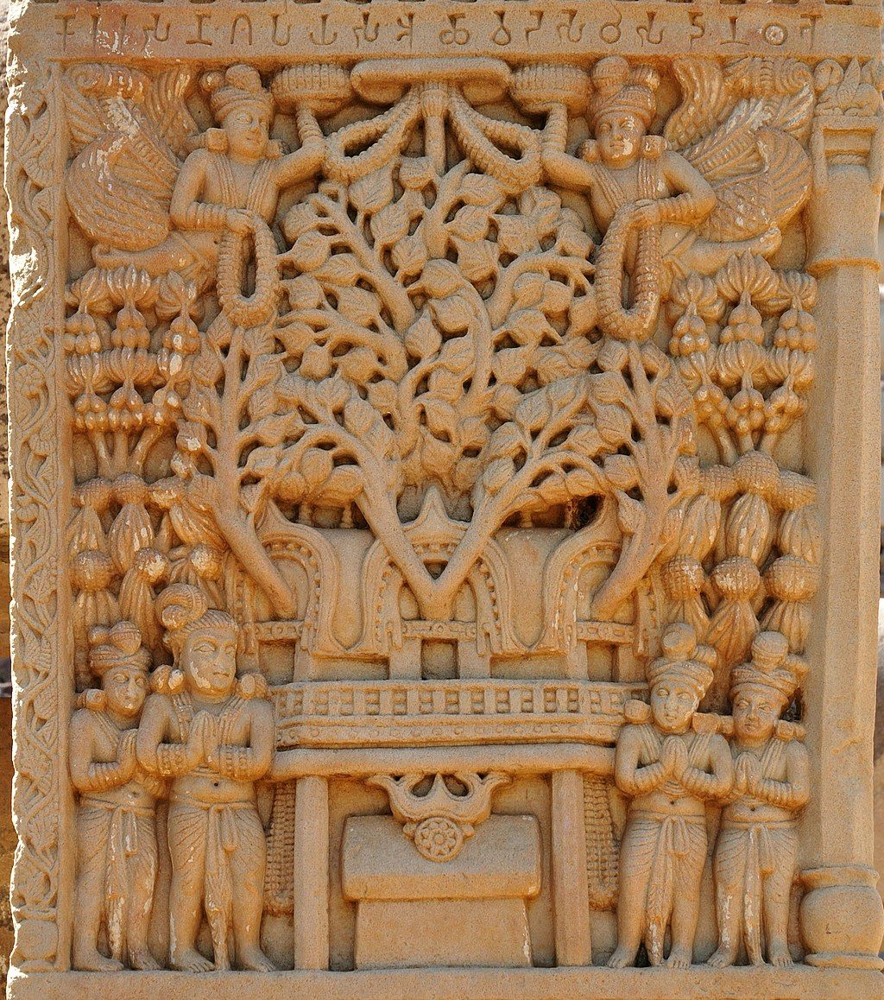

class: middle center

# *Philosophy of Art*

.red[*taste, value and aesthetic judgement*]

George Matthews, Pennsylvania College of Technology

*2020*

---
## *Philosophical questions about art*

.question[

What is art anyway? All cultures have some form of artistic production but what is its function? Philosophers seek a theoretical understanding of art.

]

.question[

Are some art works better than others, or is the value of art strictly a matter of personal taste? Philosophers are interested in exploring the nature and validity of aesthetic judgment.

]

.question[

What is the nature of creativity in the arts? What's the relation between novelty and tradition, individuality and collaboration in the arts? 

]

---
layout: true

### *Art as Representation*

---

.argument[

Art is first of all a representation -- it captures some aspect of the artist's experience of reality and presents it in a particular medium.
]

.question[

.red[What] do we represent in art and .red[why] do we do this?

]

---

The oldest surviving art dates back more than 20,000 years. The caves of Lascaux, France are filled with depictions of animals and their human hunters. 

---

These representations seem to have had a ritual function, depicting human needs and desires as much as they depicted elements of the world of the artists.

---

The Ancient Greeks depicted their gods in idealized human form, representing their vision of both divine and human perfection.

---

Even the structural elements of architecture were used as ways of representing the humanistic ideals of ancient Athens.

---

The Romans decorated their houses and palaces with depictions of Greek philosophers and heroes. This is ironic since Plato thought of art as a distraction from the quest for the truth about things.

---

Artists of the Renaissance adopted the humanistic ideals of Greece and sought to represent them directly and realistically.

---

Artistic representation of religious stories and themes played a major role in religious devotion, especially in Catholicism.

---

Early Buddhism intentionally omitted representations of the Buddha -- the founder of the tradition, but instead depicted the location of important events.

---

That changed of course and Buddhism is known for its countless depictions of the Buddha seated in meditation.

---

Some artists have used the representational power of art to show us things we wouldn't otherwise see.

---

Francisco Goya 

---

---

---

---

---

---

---

layout: false
### *Find out more*

---
class: center credits

#### Credits

*Built with:*

 

 html presentation framework 

<!-- *Photos by:* -->

[download this presentation](./pdf/07-slides.pdf) or [print it](./pdf/07-handout.pdf)

: requires a (free) GitHub account.

